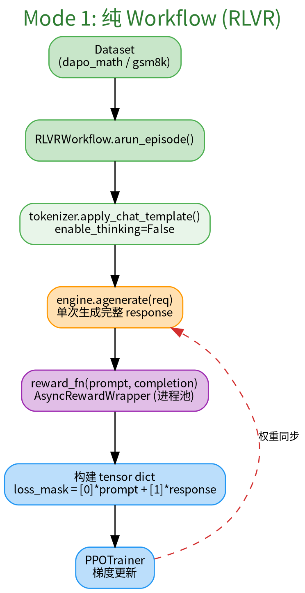
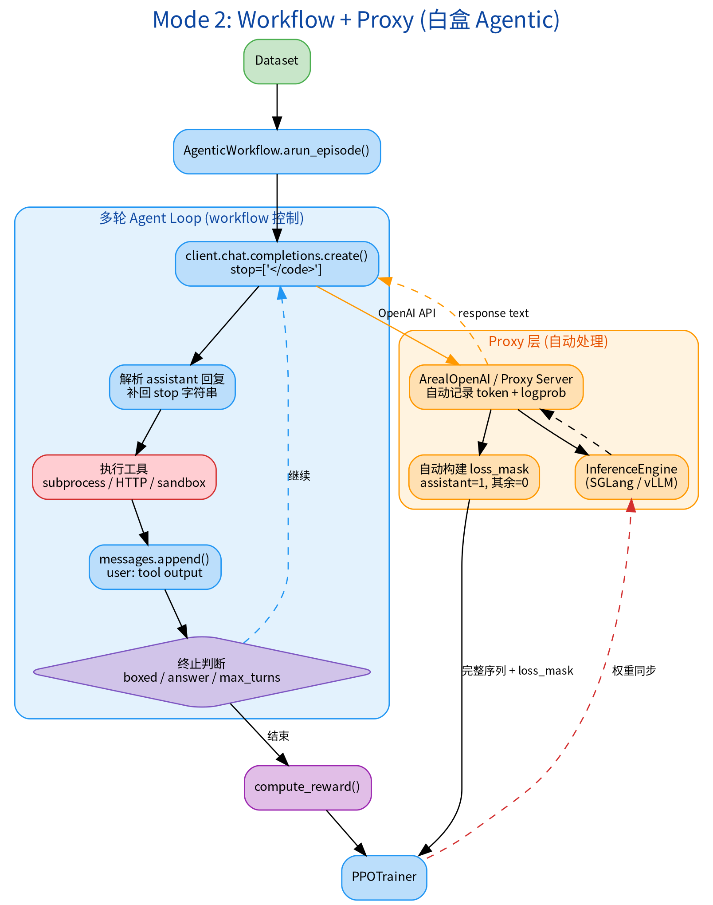
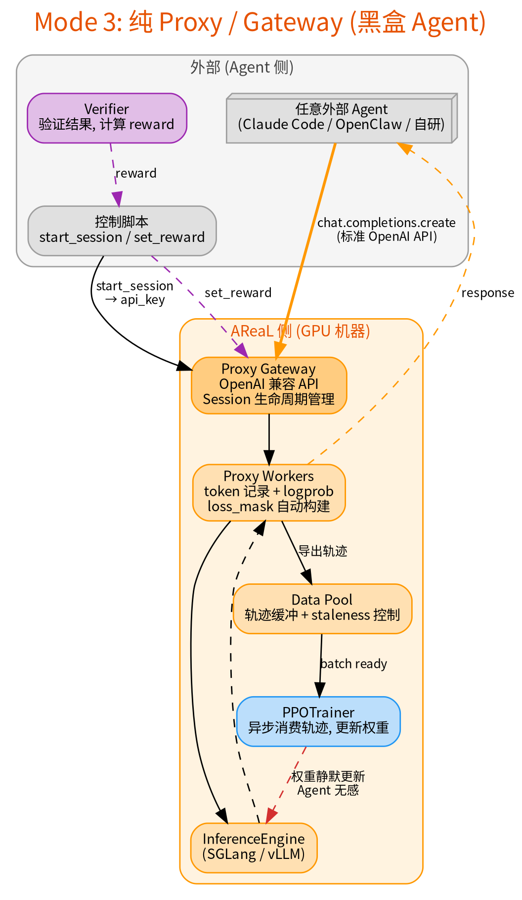

# AReaL_Fuyao: RL 训练框架设计

> 基于 AReaL，发展为面向 Agentic RL 终局态的独立框架。
>
> 相关文档：
>
> - [实践踩坑记录](lessons_learned.md) — 各 milestone 实施过程中的经验教训（持续更新）
>
> 参考来源：
>
> - [Agentic RL 训练框架综合评估报告](../learn/rl_training_frameworks/agentic_rl_frameworks_survey.md)
> - [Forge: 可扩展的 Agent RL 框架 (MiniMax)](../learn/rl_training_frameworks/forge_minimax_faithful.md)
> - [Composer 2 Technical Report (Cursor)](../learn/papers/composer2/composer2_deep_dive.md)
> - [Agentic 交互架构对比: Evals vs Harbor vs Forge](../learn/rl_training_frameworks/agentic_architectures_comparison.md)

______________________________________________________________________

## 1. 为什么基于 AReaL

综合 Forge、Composer 2、SkyRL、RLinf、ROLL、verl 等框架的评估（见[框架评估报告](../learn/rl_training_frameworks/agentic_rl_frameworks_survey.md)），终局态框架需要四个关键特征：

| 特征                   | 含义                | 后补成本               |
| ---------------------- | ------------------- | ---------------------- |
| **A: Scaffold 灵活性** | 任意 Agent 黑盒接入 | 架构级，最高           |
| **B: 场景灵活性**      | 多场景覆盖与混合    | 子系统级，可迁移       |
| **C: 异步训练**        | 生成与训练解耦      | 架构级，与 A 强关联    |
| **D: 训练引擎**        | 高效分布式训练      | 基础级，各框架差异最小 |

**AReaL 是唯一同时具备特征 A + C 的开源框架**——Gateway + Session 协议 + 异步 Data Pool + staleness 控制。这两个是架构级能力，后补成本最高。特征 B 和 D 是可迁移的业务代码和基础设施。

> Forge: "我们集成了数百种 scaffold 类型...处理了超过十万种不同的真实世界 Agent scaffold。"
>
> Composer 2: "四个解耦服务...跨 3 个 GPU region + 4 个 CPU region 运行。"

______________________________________________________________________

## 2. 三层训练模式

### Layer 1: 纯 Workflow — RLVR

单轮生成，无工具。框架直接调 `engine.agenerate()`，手动构建 loss_mask。

适用：Math RLVR、基础推理 RL。对应 AReaL 原版 `examples/math/`。

### Layer 2: AsyncOpenAI + Proxy Server — 白盒 Agentic RL

多轮工具交互，框架控制 Agent loop。Agent 用标准 `openai.AsyncOpenAI` 调 Proxy Server（subproc 模式），Proxy 自动处理 token 记录和 loss_mask 构建。

适用：Code execution、Search augmented、Terminal interaction。对应 AReaL `examples/tau2/`、`examples/search_agent/`。

**为什么需要 Proxy**：纯 Workflow 做多轮时，推理引擎的 stop-resume 机制和 Workflow 的多轮循环冲突，导致模型生成内容被误标为 loss_mask=0 不参与训练。详见 [lessons_learned.md §6](lessons_learned.md#6-%E6%8E%A8%E7%90%86%E5%BC%95%E6%93%8E-stop-resume-%E4%B8%8E-workflow-%E5%A4%9A%E8%BD%AE%E5%86%B2%E7%AA%81)。

**为什么用 AsyncOpenAI 而非 ArealOpenAI**：Agent 代码用标准 OpenAI SDK，零侵入。升级到 Layer 3 黑盒时 Agent 代码不用改，只需加 Gateway 并把 `base_url` 从 localhost 改为 gateway 地址。详见 [proxy_system.md](getting_started/proxy_system.md#6-%E5%A6%82%E4%BD%95%E9%80%89%E6%8B%A9%E6%A8%A1%E5%BC%8F)。

### Layer 3: AsyncOpenAI + Gateway — 黑盒 Agentic RL

Layer 2 的 Proxy Server 前面加 Gateway 路由层。外部 Agent 只需 `base_url + api_key`，完全不知道自己在被训练。Session 协议管理 episode 生命周期。

适用：任意外部 Agent（Claude Code、OpenClaw、自研 Multi-Agent）。对应 AReaL `examples/openclaw/`。

**从 Layer 2 升级到 Layer 3 不改 Proxy Server，不改 Agent 代码**——只加 Gateway。

> Forge §2.3: "Agent 只需将请求路由到 RL 服务 Gateway，框架自动处理数据收集和训练。"

______________________________________________________________________

## 3. 路线图

### Milestone 1: 基础 RL 场景验证

**目标**：RLVR + Code Agentic + Search Agentic RL 跑通

- Layer 1: Math RLVR ✅ 已验证
- Layer 2: Code DAPO 切 Proxy 模式，解决 loss_mask 冲突
- Layer 2: Search R1 切 Proxy 模式，接入 retrieval endpoint

踩坑记录：[lessons_learned.md](lessons_learned.md) §1-8（YAML 配置、OOM 调优、reward 多线程、enable_thinking、stop-resume 冲突、prompt 对齐等）

#### 当前状态

- **Math RLVR**：已稳定验证，可作为基础训练链路回归场景。
- **Search R1**：已完成 Proxy 模式打通，检索服务、stop token、多轮搜索和 reward 链路都已跑通；和 ROLL 对比后，工具使用强度与总序列长度已经基本对齐，reward 略低但仍处于可比实验范围。
- **Code DAPO**：已完成 Proxy 模式、`python_code` tool instruction、`max_tool_uses=1` 收口逻辑和 reward 路径修复；和 ROLL 对比后，核心行为与关键指标已经基本对齐到可比实验水平。
- **当前剩余问题**：Code DAPO 在长序列 batch 上仍有 actor 侧 OOM 风险，Search R1 / Code DAPO 的中后期训练动力学还没有完全对齐 ROLL，但已经不是“链路没打通”的问题。

**阶段判断**：Milestone 1 可以认为已经进入“基本完成”状态。下一步重点不再是证明场景能否跑通，而是收稳定性、压长序列、减少本地调试成本，并为 Layer 3 的黑盒 Agent 接入腾出接口边界。

### Milestone 2: Terminal Agentic RL

**目标**：支持 terminal 交互场景（如 SETA）

- Layer 2: Terminal workflow，接入容器/SSH 执行环境
- 沙盒管理：Fuyao sandbox 或自建容器池

### Milestone 3: 完整 Agentic RL 能力

**目标**：对齐 Composer 2 级别的 Agentic RL 能力

参考 Composer 2 的关键技术：

- **Self-Summarization**：长 horizon 场景的上下文压缩，摘要 token 参与 RL 训练
- **行为奖励体系**：超越正确性——风格奖励、工具使用惩罚、非线性长度惩罚
- **训练-部署一致性**：训练环境 = 生产环境

> Composer 2: "好的摘要（保留关键信息 → 后续做对了）被 upweight，差的摘要被 downweight。模型学会了什么信息值得保留。"

### Milestone 4: 大规模灵活的黑盒白盒 Agentic RL

**目标**：对齐 Forge 级别的规模和灵活性

参考 Forge 的关键能力：

- **多 scaffold 混合训练**：一个 batch 混合多种 Agent scaffold，模型在 scaffold 间泛化
- **Windowed FIFO 调度**：平衡系统吞吐与分布一致性
- **白盒 CM-in-the-loop**：上下文管理作为显式 Agent 动作参与训练
- **黑盒非侵入集成**：任意复杂的内部 Agent 循环（深度思考、多 Agent）

> Forge: "通过将训练循环与 Agent 内部状态解耦，MiniMax M2.5 实现了与大量黑盒 Agent 的广泛兼容。"

______________________________________________________________________

## 4. 与业界对齐

| AReaL_Fuyao           | Forge (MiniMax) | Composer 2 (Cursor)     |
| --------------------- | --------------- | ----------------------- |
| Layer 2 ArealOpenAI   | Gateway Server  | Shadow Cursor backend   |
| Layer 3 Proxy Gateway | Gateway Server  | —                       |
| StalenessManager      | Windowed FIFO   | Slot-based reconciler   |
| PPOTrainer            | Train Engine    | Training Service        |
| SGLang / vLLM         | Rollout Engine  | Inference Service       |
| Fuyao Sandbox         | Agent 侧环境    | Anyrun (Firecracker VM) |
