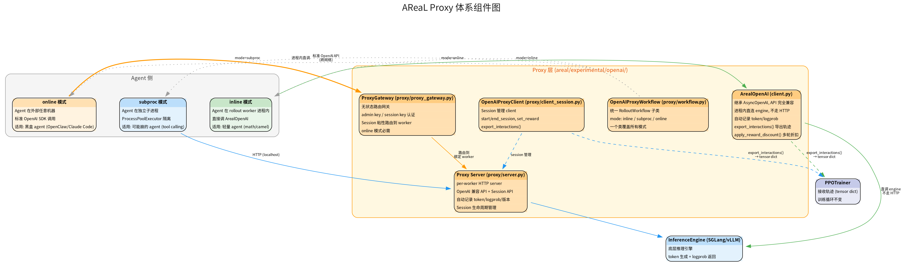
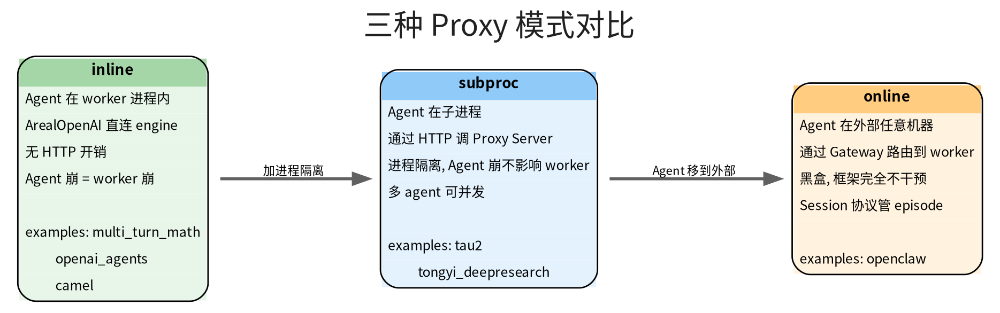
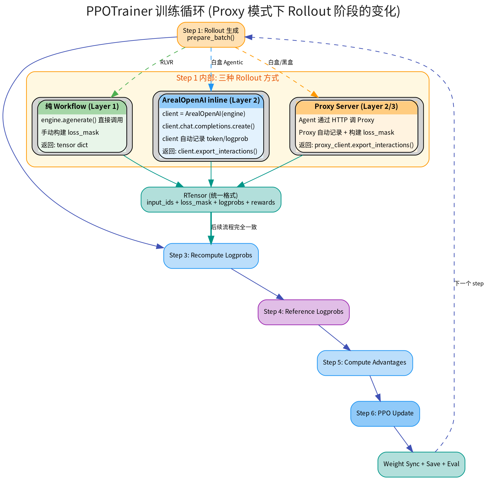

# AReaL Proxy 体系

> AReaL 通过 Proxy 层将 Agent 与推理引擎解耦，支持从进程内直连到跨网络黑盒的全谱系 Agent 接入。

## 1. 为什么需要 Proxy

纯 Workflow 模式下，多轮 Agentic 场景存在一个根本冲突：

- **推理引擎**有内部的 stop-resume 循环——遇到 stop_strings 后把生成内容拼回 input 继续生成
- **Workflow** 也有自己的多轮循环——每轮调 `engine.agenerate()`，手动拼接 token

两层循环嵌套导致 `resp.input_tokens` 包含了模型生成的内容（被标 loss_mask=0），模型生成的推理和代码不参与训练。

Proxy 层的解决方案：把推理引擎封装成 OpenAI 兼容 API。Agent 在**消息级别**操作（append message），Proxy 在**token 级别**自动处理记录、拼接和 loss_mask 构建。

## 2. 组件图谱



### 核心组件

| 组件                    | 位置                                          | 职责                                                  |
| ----------------------- | --------------------------------------------- | ----------------------------------------------------- |
| **ArealOpenAI**         | `experimental/openai/client.py`               | 进程内 OpenAI 兼容 client，直连 engine                |
| **OpenAIProxyWorkflow** | `experimental/openai/proxy/workflow.py`       | 统一 RolloutWorkflow，按 mode 切换行为                |
| **Proxy Server**        | `experimental/openai/proxy/server.py`         | per-worker HTTP server，暴露 OpenAI API + Session API |
| **OpenAIProxyClient**   | `experimental/openai/proxy/client_session.py` | Session 管理 client（start/end/reward/export）        |
| **ProxyGateway**        | `experimental/openai/proxy/proxy_gateway.py`  | 无状态路由网关，session 粘性分发                      |

### 组件间关系

```
ArealOpenAI ─── 进程内直连 engine（inline 模式）
                不走 HTTP，自己记录 token

Proxy Server ── HTTP server，接收 Agent 的 chat.completions 请求
                转发到 engine，自动记录 token/logprob
                管理 session 生命周期

ProxyGateway ── 挡在多个 Proxy Server 前面
                路由外部请求到绑定的 worker
                仅 online 模式需要

OpenAIProxyClient ── 封装 session 协议
                     start_session / set_reward / export_interactions

OpenAIProxyWorkflow ── 统一 workflow 入口
                       根据 mode 参数选择用哪些组件
```

## 3. 三种模式



### inline

Agent 在 rollout worker **进程内**运行。通过 `ArealOpenAI` 直连 engine，不走 HTTP。

```python
async def arun_episode(self, engine, data):
    client = ArealOpenAI(engine=engine, tokenizer=self.tokenizer)
    reward = await self.agent.run_agent(data, client=client)
    client.apply_reward_discount(turn_discount=0.9)
    return client.export_interactions(style="concat")
```

- Agent 崩 = worker 崩（无隔离）
- 性能最好（无网络开销）
- 适用：轻量 agent——`examples/multi_turn_math/`、`examples/openai_agents/`、`examples/camel/`

### subproc

Agent 在**独立子进程**运行（`ProcessPoolExecutor`）。通过 HTTP 调 Proxy Server。

```python
# OpenAIProxyWorkflow 自动管理
# Agent 代码用标准 openai SDK：
client = AsyncOpenAI(base_url=proxy_url, api_key=session_key)
resp = await client.chat.completions.create(messages=...)
```

- 进程隔离——Agent 崩不影响 worker
- 适用：可能崩的 agent——`examples/tau2/`、`examples/search_agent/tongyi_deepresearch/`

### online

Agent 在**外部任意机器**运行。通过 ProxyGateway 路由到绑定的 Proxy Server。

```bash
# 外部 Agent 只需配置
export OPENAI_BASE_URL=http://gateway:port
export OPENAI_API_KEY=sk-sess-xxxxx

# 然后正常运行（完全不知道后面是 RL 框架）
zeroclaw channel start
```

- 黑盒——框架完全不干预 Agent 内部
- Session 协议管理 episode 生命周期
- 适用：任意外部 Agent——`examples/openclaw/`

## 4. Session 协议

所有模式共享同一套 Session 协议（inline 模式由 `ArealOpenAI` 内部自动管理）：

| API                            | 用途                                      | 调用方                       |
| ------------------------------ | ----------------------------------------- | ---------------------------- |
| `POST /rl/start_session`       | 开始新 episode，返回 session_id + api_key | 控制脚本 / OpenAIProxyClient |
| `POST /v1/chat/completions`    | 标准 OpenAI API，Agent 正常调用           | Agent                        |
| `POST /rl/set_reward`          | 给 completion 或 episode 打分             | 控制脚本 / workflow          |
| `POST /rl/end_session`         | 结束 session，导出轨迹                    | OpenAIProxyClient            |
| `POST /rl/export_interactions` | 导出完整轨迹（token dict + loss_mask）    | OpenAIProxyClient            |

### loss_mask 构建规则

Proxy 按 message role 自动标记：

| 内容          | role          | loss_mask | 参与训练 |
| ------------- | ------------- | --------- | -------- |
| System prompt | system        | 0         | 否       |
| User 消息     | user          | 0         | 否       |
| 工具输出      | user/tool     | 0         | 否       |
| **模型回复**  | **assistant** | **1**     | **是**   |

多轮折扣：`apply_reward_discount(turn_discount=0.9)` 对早期轮次的 reward 打折。

### 导出格式

前面的 Session 协议解决的是“谁参与训练、谁被 `loss_mask=1`”。而 `export_interactions()` 的 style 决定的是：**这些多轮 interaction 最终按什么边界导出成训练样本**。

`export_interactions()` 支持两种 style：

| style        | 含义                             | 适用                |
| ------------ | -------------------------------- | ------------------- |
| `individual` | 每轮 completion 独立一条训练样本 | 多轮独立评分        |
| `concat`     | 所有轮次拼成一条长序列           | 整体评分（GRPO 等） |

### `concat` 和 `individual` 的真正区别

两者不只是“导出几条样本”的区别，还取决于 **chat template 是否支持构建对话树**。

- `individual`：不尝试把多轮对话拼成一棵会话树，所有 completion 原样导出。对 chat template 几乎没有额外要求。
- `concat`：需要根据 parent-child 关系把多轮 interaction 拼成一条完整 token 序列，因此要求 interaction 的 `chat_template_type="concat"`，并且子轮 prompt 必须能严格对齐到父轮 prompt + 新消息。

### Qwen3 为什么在 `concat` 下容易出问题

Qwen3 默认走 HuggingFace chat template（`chat_template_type="hf"`），而不是 `concat` 模式。它的模板里还可能带 think token / 特殊控制 token，导致：

- 多轮消息不能稳定还原成严格的 prefix-tree
- `export_interactions(style="concat")` 会直接报：
  `Cannot export interactions in 'concat' style when interaction.chat_template_type != 'concat'`

因此对 Qwen3 这类模型：

- **默认优先用 `individual`**
- 只有在确认 chat template 本身就是 `concat` 语义、并且 stop / parent-child token 对齐都稳定时，才考虑 `concat`

这也是 Fuyao 的 `search_r1` / `code_dapo` 最终统一切到 `export_style: individual` 的原因。

## 5. 与训练循环的关系



**关键：不管用哪种模式，PPOTrainer 的主循环不变。** 变的只是 Step 1 Rollout 阶段的内部实现。

三种 Rollout 方式最终都产出统一格式的 RTensor（`input_ids` + `loss_mask` + `logprobs` + `rewards`），后续的 `compute_logp → compute_advantages → ppo_update → weight_sync` 完全一致。

## 6. 如何选择模式

### 推荐路径

| 场景                          | 推荐模式    | 理由                                          |
| ----------------------------- | ----------- | --------------------------------------------- |
| RLVR（单轮，无工具）          | 纯 Workflow | 最简单，不需要 Proxy                          |
| **所有 Agentic 场景（白盒）** | **subproc** | 统一用 `AsyncOpenAI` + Proxy Server，一步到位 |
| **外部 Agent（黑盒）**        | **online**  | subproc 基础上加 Gateway，Agent 代码不用改    |

### 为什么不推荐 inline（ArealOpenAI）

`ArealOpenAI` 是进程内直连 engine 的捷径，延迟最低。但：

- Agent 代码必须 `import ArealOpenAI`——不是标准 OpenAI SDK，有侵入性
- Agent 崩 = worker 崩，无隔离
- 从 inline 切到 online（黑盒）需要改 Agent 代码（ArealOpenAI → AsyncOpenAI）

**直接用 `AsyncOpenAI` + Proxy Server（subproc 模式）**：

- Agent 代码就是标准 `openai.AsyncOpenAI`，零侵入
- 有进程隔离
- 升级到黑盒（online）时只需加 Gateway，Agent 代码和 Proxy Server 都不用改

这条路径对齐 Forge 的 Gateway 架构——Agent 通过标准协议与中间件交互，中间件与训练引擎解耦。

### 演进路径

```
subproc (现在)                    online (后续)
Agent → Proxy Server → Engine    Agent → Gateway → Proxy Server → Engine
  ↑ 标准 AsyncOpenAI               ↑ 同样的 AsyncOpenAI，只改 base_url
  ↑ 子进程内                        ↑ 任意外部机器
```

从 subproc 升级到 online 是加一层 Gateway，不改 Proxy Server，不改 Agent 代码。
