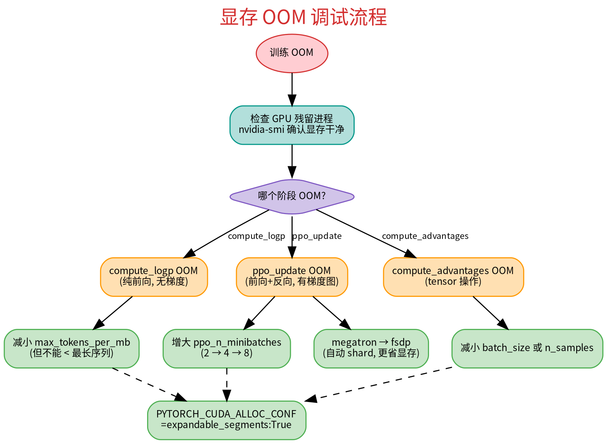
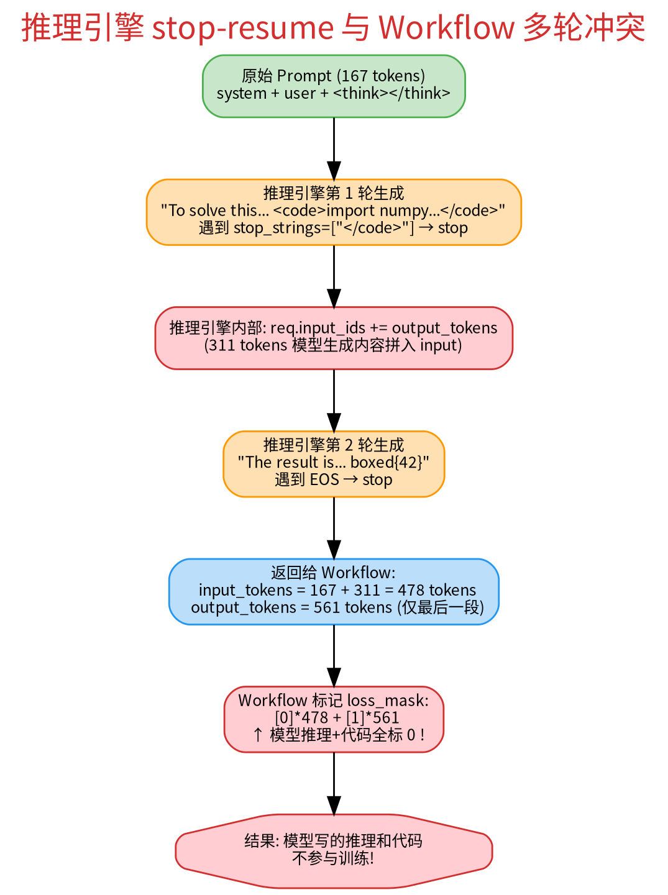
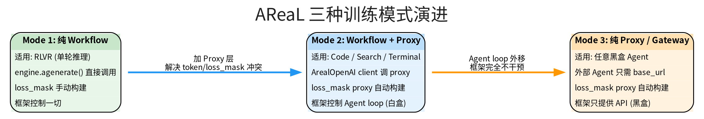

# AReaL Fuyao 适配实践总结与踩坑记录

> 从 Math RLVR 到 Code DAPO / Search R1 的完整实践路径，记录所有关键发现和设计决策。

## 1. 项目结构：不侵入原版

### 原则

Fuyao 适配默认尽量自包含在 `fuyao_examples/`，尽量不改上游 `areal/`。

### 踩过的坑

- **最初把 workflow 放在 `areal/workflow/`、dataset 放在 `areal/dataset/`、训练脚本放在 `examples/agentic/`** — 混在原版目录里，升级 upstream 时会冲突
- **修改了 `areal/reward/__init__.py`（多线程 fallback）、`areal/utils/stats_logger.py`（tracking patch）、`areal/engine/vllm_remote.py`（stop 支持）、`areal/infra/utils/launcher.py`（环境变量继承）** — 全部侵入原版

### 最终方案

```
fuyao_examples/
├── math/           # workflow + train + yaml 同目录（对齐原版 examples 模式）
├── search_r1/
├── code_dapo/
├── dataset/        # dapo_math 数据加载器
├── configs.py      # AgenticConfig
├── reward.py       # math_verify 多线程 fallback（外部实现）
├── tracking_patch.py  # DeepInsight 指标映射（monkey-patch，不改原版）
└── fuyao_areal_run.sh # 统一启动脚本
```

所有对原版的"需求"通过外部包装实现：

- reward 多线程问题 → `fuyao_examples/reward.py` 包装
- 指标映射 → `fuyao_examples/tracking_patch.py` monkey-patch `StatsLogger.commit`
- 环境变量 → `fuyao_areal_run.sh` 设置，不改 launcher

**补充**：当前仍有少量上游补丁已经接受并保留，例如：

- `areal/api/io_struct.py`：custom stop string 返回兼容
- `areal/api/cli_args.py` / `experimental/openai/*`：`chat_template_kwargs` 透传
- `areal/utils/network.py`：本地端口分配顺序扫描

______________________________________________________________________

## 2. YAML 配置踩坑

### GPU 资源分配

**坑**：`rollout: "vllm:d8"` + `actor: "megatron:d8"` 需要 16 GPU，本机只有 8。

**理解**：`dX` 表示数据并行度 = 需要 X 张 GPU。`scheduling_strategy: separation`（默认）意味着 rollout 和 actor 各自独占 GPU。

**方案**：`rollout: d4` + `actor: d4` = 8 GPU。ref 用 `colocation` 寄生在 actor 上不额外占 GPU。

### 自定义顶级字段

**坑**：在 yaml 顶层加 `model_path`、`data_path` 自定义字段 → OmegaConf 报错 `Key 'model_path' not in 'GRPOConfig'`。

**原因**：`GRPOConfig` 是 structured config，不允许多余的 key。

**方案**：路径直接写在 `actor.path` 和 `train_dataset.path` 里，用注释标注。

### SGLang context_length

**坑**：`context_length: 32768` 对 `max_new_tokens: 8192` 来说浪费 2/3 显存。

**理解**：`context_length` 是 KV cache 预分配上限（prompt + response），设太大减少并发能力。

**方案**：设为 `max_new_tokens` 的 2 倍左右（16384），留够 prompt 余量。

### max_tokens_per_mb vs ppo_n_minibatches

**坑**：两个参数容易混淆。

**理解**：

- `max_tokens_per_mb`：控制 `compute_logp`/`compute_advantages` 的前向 micro-batch 大小（按 token 数切分）。必须 >= 单条最长序列。
- `ppo_n_minibatches`：控制 `ppo_update` 的 forward+backward 切分（按序列数切分）。相当于梯度累积。

### SwanLab API Key

**坑**：`${oc.env:SWANLAB_API_KEY}` 没有 fallback，环境变量缺失时直接报错。

**方案**：`${oc.env:SWANLAB_API_KEY,}` 加空 fallback。

### experiment_name 冲突

**坑**：多次运行用同一个 `experiment_name`，rollout 轨迹 dump 到同一目录，新旧数据混杂。

**方案**：fuyao 平台提交时 `BIFROST_JOB_NAME` 自带时间戳属性，本地调试时手动带上时间戳。

______________________________________________________________________

## 3. 显存 OOM 调优



### 逐步升级的 OOM 经历

| 尝试 | 配置                                       | 结果                               |
| ---- | ------------------------------------------ | ---------------------------------- |
| 1    | megatron:d4, bs=128, n_samples=4           | compute_advantages OOM             |
| 2    | megatron:d4, bs=32, n_samples=4            | ppo_update OOM（旧进程残留占显存） |
| 3    | megatron:d4, bs=32, max_tokens_per_mb=8192 | 单条序列 > 8192 报错               |
| 4    | megatron:d4, bs=16, enable_offload=true    | ppo_update OOM（仍太大）           |
| 5    | **fsdp:d4, bs=16, n_samples=2**            | **成功**，36.7/79.25 GB            |

### 关键教训

- **FSDP 比 Megatron 更省显存**：4B 模型不需要 Megatron，FSDP 自动 shard 参数
- **PyTorch CUDA allocator 碎片化**：`reserved` 远大于 `allocated` 时加 `PYTORCH_CUDA_ALLOC_CONF=expandable_segments:True`
- **残留进程是隐形杀手**：每次重启前务必确认 GPU 干净
- **显存逐步增长是正常的**：不同 step 的序列长度变化导致 allocator 缓存增长，最终稳定

### 显存监控指标

```
Memory-Usage ppo update: memory allocated (GB): 7.51, memory reserved (GB): 28.04, device memory used/total (GB): 36.73/79.25
```

- `allocated`：PyTorch 实际使用
- `reserved`：PyTorch CUDA allocator 预留（包含缓存）
- `device used`：GPU 总占用（含非 PyTorch 进程）
- 健康区间：`device used/total` \< 85%

### SGLang 推理 OOM（KV cache 撑爆）

**现象**：训练跑到 Step 330 触发 eval-rollout 时，SGLang server 持续 `KV cache pool is full`，最终进程崩溃（端口拒绝连接），无错误日志——典型的 CUDA OOM 被系统 kill。随后 actor 的 `update_weights` 因 gloo 通信等了 2 小时超时，整个训练重启。

**配置**：Qwen3-4B, `max_new_tokens: 8192`, `max_concurrent_rollouts: 128`, `sglang.mem_fraction_static: 0.8`

**根因分析**：

1. **`max_concurrent_rollouts` 是 AReaL 框架参数，不是推理引擎参数**。实现在 `StalenessManager.get_capacity()`（`areal/infra/staleness_manager.py:100-101`），控制 AReaL dispatcher 同时提交给 SGLang 的 HTTP 请求数上限。SGLang 自身的并发由 `sglang.max_running_requests`（配置为 null = 不限）控制。

1. **Eval 不会和 train rollout 叠加请求**（train 在 eval 前已 pause），但 **eval 是连续满载推理没有间歇**。Train rollout 每凑够一个 batch 就停下做 training step / weight update / checkpoint，SGLang 有空闲释放 KV cache。Eval 把整个验证集一口气全提交（`rl_trainer.py:847-857`），SGLang 持续满载几十分钟。

1. **训练后期模型生成的序列越来越长**。到 Step 330 时 `seq_len/avg` 从 ~1000 涨到 ~3600，`seq_len/max` 到 8383。128 并发 × 长序列 = KV cache 撑爆。

1. **Eval 的 temperature=0.6**（低于 train 的 0.99），生成更长更确定的序列，单条 KV cache 占用更高。

**与 ROLL 框架的对比**：

|                              | ROLL                                        | AReaL                                         |
| ---------------------------- | ------------------------------------------- | --------------------------------------------- |
| 推理模式                     | 批量同步 `actor_cluster.generate(batch)`    | 逐条异步 HTTP 请求                            |
| 并发控制                     | `rollout_batch_size`(64) 个 prompt 整体发送 | `max_concurrent_rollouts`(128) 个独立请求并发 |
| SGLang `mem_fraction_static` | **0.7**（给 KV cache 留更多空间）           | **0.8**                                       |
| KV cache 管理                | 批量分配，SGLang 知道总需求量               | 逐条到达，难以预估总量                        |
| Eval                         | 完全串行，跑完 eval 再 generate             | eval 连续满载不停歇                           |

ROLL 即使用 Qwen3-8B + `response_length: 32768`（32k）也不 OOM，因为同步批量发送让 SGLang 能统一管理 KV cache，且 `mem_fraction_static: 0.7` 留了更多动态空间。

**方案**：降低 `max_concurrent_rollouts`（如 128 → 64），减少 SGLang 同时持有的 KV cache 量。这是最直接有效的调整，因为根因是并发请求过多 × 长序列的显存叠加。

### Eval 轨迹数据远大于 Train 轨迹

**现象**：`eval-rollout/` 目录下的轨迹文件比 `rollout/` 目录大得多。

**原因**：

|        | Train Rollout                                                     | Eval Rollout                                |
| ------ | ----------------------------------------------------------------- | ------------------------------------------- |
| 数据量 | 每步凑够 `batch_size` 条即停                                      | **整个验证集**全部跑完                      |
| 过滤   | staleness 拒绝（`max_head_offpolicyness: 2`）+ `should_accept_fn` | **无过滤**（`max_head_offpolicyness=1e12`） |
| 频率   | 每步                                                              | 每 `eval_steps` 步，但每次全量              |

Eval rollout 初始化时 `max_head_offpolicyness` 被设为 `int(1e12)`（`rl_trainer.py:694`），所有轨迹全部 accept 并保存。

### math_verify 超时异常穿透导致 AsyncTaskRunner 崩溃

**现象**：训练到 Step 9 的 eval-rollout 时，`eval-rollout/1` worker 崩溃，后续所有 submit 请求报 `AsyncTaskRunner is exiting, cannot wait for results`。

**根因**：模型生成了超复杂数学表达式（阶乘基展开），`math_verify` 调用 sympy 求值时触发深度递归，在 `str(pred)` → `sympy.__str__` → `evalf_sum` → `euler_maclaurin` → 递归 `diff()` 路径上被 `signal.SIGALRM` 超时打断，抛出 `math_verify.errors.TimeoutException`。

这个异常发生在 `ProcessPoolExecutor` 子进程中（`fuyao_examples/reward.py:51` 的 `math_reward_fn` 通过 `AsyncRewardWrapper` 调用），以 `_RemoteTraceback` 形式传回主进程。`AsyncRewardWrapper.__call__`（`reward_api.py:152`）只捕获了 `TimeoutError`（asyncio 超时）和 `BrokenProcessPool`，没有捕获 `math_verify.TimeoutException`（子进程远程异常），导致异常穿透到 `AsyncTaskRunner` 线程，线程崩溃退出。

**注意**：`reward_api.py` 是上游代码，未被修改。这是上游 `AsyncRewardWrapper` 异常处理的不完整。此问题有概率性——取决于模型是否恰好生成触发 sympy 深度计算的表达式。

______________________________________________________________________

## 4. Reward 计算

### math_verify 多线程问题

**坑**：`MathVerifyWorker.verify()` 在 AReaL 的多线程 RPC 环境下抛 `ValueError: Math-Verify 'parse' function doesn't support threaded environment`。

**原因**：`math_verify` 内部用 `signal.alarm()` 做超时控制，不支持非主线程。

**影响**：code_dapo 跑了 99 步 reward 全是 0——不是模型答错了，是 verify 函数崩了。

**方案**：`fuyao_examples/reward.py` 提供 `math_verify_with_fallback()`，捕获异常后改用无超时的 `math_verify_parse` + `math_verify_grader`。

### RLVR 的 reward_fn vs Agentic 的内嵌 reward

- RLVR：reward_fn 通过字符串路径传给 `RLVRWorkflow`，在 `AsyncRewardWrapper`（ProcessPoolExecutor）中执行 → 有进程隔离，多线程问题被绕过
- Agentic workflow：直接在 `arun_episode` 里调 `worker.verify()` → 在 RPC 线程中执行，触发多线程问题

### Search R1 reward 语义要足够克制

**坑**：最初 Search R1 的 reward 设计成 `EM + 0.2 * tool_success_rate`。结果日志里经常看到 `task_reward/avg ≈ 0.2`，容易误判成“模型部分答对了”，但实际语义只是“搜到了，答案仍然错了”。

**现象**：

- `reward = 0.0`：没答对，也没拿到有效搜索结果
- `reward = 0.2`：没答对，但搜索成功
- `reward = 1.0`：答对
- `reward = 1.2`：答对且搜索成功

这会让 Search R1 的主指标同时混入“答案正确性”和“工具可用性”，训练判断不够干净。

**最终方案**：Search R1 reward 只保留答案 exact-match，工具调用统计仅作为观测指标记录，不再进入 reward。这样 `ppo_actor/task_reward/avg` 就只表示答案正确率。

**补充**：AReaL 日志里的 `ppo_actor/task_reward/avg` 记录的是原始 reward；`reward_bias` / `reward_scaling` 只在 PPO 内部计算 advantage 时生效，不会改写这个观测值。

### Search R1 / Code DAPO 的 stop tag 不能无条件补回

**坑**：最初 agent 代码默认假设推理后端会把 `</search>` / `</code>` 截掉，所以在解析和回写消息历史时无条件补闭标签。

**现象**：

- Search R1 多轮轨迹里会出现额外的 `</search>`
- Code DAPO 多轮轨迹里会出现额外的 `</code>`
- 第二轮 prompt 会把这些重复闭标签一并带回模型，徒增长度，还会污染工具解析

**根因**：不同推理路径对 stop string 的返回行为不一致。有的会裁掉 stop tag，有的会把 stop tag 保留在返回文本里。agent 侧如果无条件补标签，就会在“已保留 stop tag”的路径上重复闭合。

**最终方案**：只在闭标签缺失时才补回 stop tag；如果返回文本已经带了 `</search>` / `</code>`，就原样使用。

______________________________________________________________________

## 5. Qwen3 enable_thinking 问题

### 现象

- RLVR 轨迹：prompt 以 `<think>\n\n</think>\n\n` 结尾（空 think 块，跳过思考），模型直接给答案
- Code DAPO 轨迹：模型生成 `<think>\n实际推理内容...` 长达几千 token，纯推理后直接 `\boxed{}`，不用工具

### 原因

- RLVR 的 `RLVRWorkflow` 传了 `enable_thinking=False` → tokenizer 加空 `<think></think>` → 模型跳过推理
- Code DAPO 的 `CodeExecWorkflow` 没传 → Qwen3 默认行为，模型自发进入 thinking 模式
- ROLL 的 `custom_apply_chat_template` 默认 `enable_thinking=False`

### 影响

thinking 模式下模型写了几千 token 推理就直接给答案，**完全不用工具**（`tool_use_count=0`）。
关闭 thinking 后模型进入"行动"模式，开始用 `<code>` 写代码（`tool_use_count ~1.0`）。

### 方案

code_dapo 和 search_r1 的 workflow 里 `apply_chat_template` 加 `enable_thinking=False`。

### Code DAPO 首轮 prompt 很容易重复注入“可写代码”说明

**坑**：AReaL Code DAPO 在 system prompt 里已经声明了一遍“可以写代码”，后来为了对齐 ROLL 又把 `python_code` tool instruction 整段拼进了第一轮 user。结果首轮 prompt 一上来就重复。

**影响**：

- 首轮 prompt 长度被无意义拉高
- 和 ROLL 的 prompt 不再等价
- 会放大后续多轮历史叠加时的上下文膨胀

**最终方案**：system prompt 只保留“step by step + `\\boxed{}`”这类简短指令；代码能力说明统一只保留在第一轮 user / tool instruction 注入点。

______________________________________________________________________

## 6. 推理引擎 stop-resume 与 Workflow 多轮冲突



### 这是最深的坑

**现象**：code_dapo 的 rollout 轨迹里，prompt 字段包含了模型生成的推理和代码内容（loss_mask=0），completion 字段只有代码执行后的回答。

**根因**：AReaL 推理引擎有内部的 stop-resume 循环（`remote_inf_engine.py:833`）：

```python
# 模型生成遇到 stop_strings → stop
# 把 output_tokens 拼回 req.input_ids → 继续生成
req.input_ids += gen_result.output_tokens
```

返回给 workflow 的 `resp.input_tokens` 包含了原始 prompt + 中间轮次的生成内容，全部标为 `loss_mask=0`。

**影响**：模型的推理过程和代码不参与训练，只有最后一段 output 参与。这相当于模型写了代码但训练不知道。

### AReaL 的两种 Agentic 模式

| 模式                 | 适用场景         | loss_mask 处理                    | 代表                                        |
| -------------------- | ---------------- | --------------------------------- | ------------------------------------------- |
| **纯 Workflow**      | 简单单轮（RLVR） | workflow 手动管 token + loss_mask | `examples/math/`                            |
| **Workflow + Proxy** | 多轮 Agentic     | proxy 层自动处理 token/loss_mask  | `examples/openai_agents/`、`examples/tau2/` |

纯 Workflow 模式做多轮时，workflow 的循环和推理引擎的 stop-resume 会冲突。Proxy 模式把推理引擎封装成 OpenAI API，workflow 在消息级别操作，proxy 自动处理 token 级别的细节。

### 原版 agentic examples 的做法

- `examples/tir/`：纯 Workflow，但用两阶段 stop（先 stop 在 start marker，再 stop 在 end marker），每次只 stop 一个标记，避免冲突
- `examples/openai_agents/`、`examples/tau2/`、`examples/search_agent/`：Workflow 包装 Proxy，通过 `ArealOpenAI` client 交互

### 方案

code_dapo 和 search_r1 统一切到 **`AsyncOpenAI` + Proxy Server（subproc 模式）**：

- Agent 代码用标准 `openai.AsyncOpenAI`，不用 `ArealOpenAI`
- Proxy Server 自动处理 token/logprob 记录和 loss_mask 构建
- 后续升级到黑盒（online）时只需加 Gateway，Agent 代码和 Proxy Server 不用改

不用 `ArealOpenAI`（inline 模式）的原因：虽然延迟更低，但 Agent 代码有 AReaL 侵入性，升级到黑盒需要重写。直接用标准 SDK 一步到位，对齐 Forge Gateway 架构。

______________________________________________________________________

## 7. 数据与 Prompt 对齐

### dapo_math_17k 数据格式

```
prompt: 纯数学题目文本
solution: 纯数字答案（如 "34"，没有 \boxed{} 包裹）
reward_model.ground_truth: 同 solution
source_prompt: 带完整指令的 prompt（"Solve step by step... Answer: $Answer"）
```

`dapo_math.py` 用 `_extract_boxed_answer(solution)` 提取答案。solution 是纯数字，找不到 `\boxed{}`，fallback 返回原值。结果正确但路径不优雅。

### Search R1 数据自带完整 prompt

nq_search 数据的 `prompt` 字段包含完整的工具使用指令（`<search>`/`<answer>`/`<information>` 标签说明）。

**坑**：最初 `train_search_r1.py` 只保留了 `question` 和 `golden_answers`，丢弃了 `prompt` 字段，然后 workflow 自己拼 prompt——丢失了原始指令。

**坑**：workflow 用 `<result>` 标签返回搜索结果，但数据 prompt 里告诉模型结果在 `<information>` 标签中。

**方案**：保留 `prompt` 字段，workflow 优先使用；搜索结果改用 `<information>` 标签。

### Code DAPO system_prompt

**坑**：最初 system_prompt 只有 `"Please reason step by step, and put your final answer within \boxed{}"`，没有告诉模型可以用 `<code>` 写代码。模型 100% 纯推理，不用工具。

**方案**：对齐 ROLL 的 `PythonCodeTool.tool_instruction`，在 system_prompt 里加上代码执行能力说明。

### stop_strings 闭合标签问题

**坑**：SGLang/vLLM 的 `stop_strings=["</code>"]` 会在输出中**去掉** `</code>`。模型生成 `<code>print(1)</code>` 被截成 `<code>print(1)`，正则 `<code>(.*?)</code>` 匹配不到。

**方案**：`_extract_code` 加 fallback，找不到完整闭合标签时匹配未闭合的 `<code>` 开标签。

### Search R1 的 `</search>` 不能无脑补

**坑**：最初 Search R1 agent 假设后端会把 `</search>` 从返回文本里裁掉，于是解析 query 和拼接多轮历史时都无条件补一个 `</search>`。

**现象**：当前 Proxy/SGLang 链路下，completion 经常已经自带 `</search>`。如果再无条件补一次，多轮轨迹就会出现：

```text
<search> ... </search>
</search>
```

第二轮 prompt 会带着重复闭标签进入模型，轨迹脏化。

**根因**：不同后端对 stop token 的返回行为不一致。Code 场景经常是“闭标签被裁掉”，但 Search R1 这条链路里 `</search>` 实际保留在 completion 里。

**最终方案**：只在文本里存在 `<search>` 且缺失 `</search>` 时，才补闭标签；已经闭合的 completion 原样保留。

______________________________________________________________________

## 8. 启动脚本问题

### sgl_kernel stub

**坑**：启动脚本把 `areal/_stubs`（假的 sgl_kernel）加进 PYTHONPATH + `SGLANG_KERNEL_DISABLE=1` → SGLang 加载 stub 后在 `torch.library.register_fake` 时崩溃 → server launch 超时。

**方案**：删掉 stub 路径和 `SGLANG_KERNEL_DISABLE`，用 venv 里的真实 sgl_kernel。

### 进程退出码

**坑**：训练用 `&` 后台跑 + `wait`，OOM 崩溃后 fuyao 平台不知道 job 失败（退出码被吞）。

**方案**：前台直接跑 python，捕获退出码传递给平台。

______________________________________________________________________

## 9. 关键指标解读

### 训练效果

| 指标                    | 含义          | 健康范围          |
| ----------------------- | ------------- | ----------------- |
| `task_reward/avg`       | 平均正确率    | 应随训练上升      |
| `update/entropy/avg`    | 策略熵        | > 0.1（不能塌缩） |
| `update/grad_norm`      | 梯度范数      | \< 100            |
| `update/clip_ratio/avg` | PPO clip 比例 | \< 0.3            |

### Off-policy 健康度

| 指标                               | 含义                              |
| ---------------------------------- | --------------------------------- |
| `version_stats/sample_staleness_*` | 样本版本滞后                      |
| `behave_imp_weight/max`            | 接近 cap(5.0) 说明严重 off-policy |

### 工具使用（Agentic 场景）

Agentic 指标**不能跨场景直接按名字类比**。AReaL 的 `search_r1` 和 `code_dapo`，以及 ROLL 的统计字段，语义并不完全统一。

| 场景 / 框架     | 指标                           | 实际含义                                          |
| --------------- | ------------------------------ | ------------------------------------------------- |
| AReaL Code DAPO | `rollout/tool_use_count`       | 每条轨迹真实工具调用次数                          |
| AReaL Code DAPO | `rollout/tool_use_success`     | 成功调用率 = `成功次数 / 调用次数`                |
| AReaL Search R1 | `rollout/tool_use_attempts`    | 每条轨迹真实搜索次数                              |
| AReaL Search R1 | `rollout/successful_tool_uses` | 成功搜索次数                                      |
| AReaL Search R1 | `rollout/tool_use_rate`        | 是否至少搜过一次的 0/1 rate                       |
| AReaL Search R1 | `rollout/tool_success_rate`    | `成功搜索次数 / 搜索次数`                         |
| ROLL Search R1  | `env/.../tool_use_counter`     | episode 结束时的累计搜索次数（聚合方式是 `last`） |
| ROLL Search R1  | `env/.../tool_success_counter` | episode 结束时的累计成功次数（聚合方式是 `last`） |
| ROLL Code DAPO  | `env/.../tool_use_counter`     | episode 结束时的累计工具调用次数                  |
| ROLL Code DAPO  | `env/.../tool_success_counter` | episode 结束时的累计成功次数                      |

**结论**：比较 Search R1 时，应该看：

- `AReaL rollout/tool_use_attempts` ↔ `ROLL env/.../tool_use_counter`
- `AReaL rollout/successful_tool_uses` ↔ `ROLL env/.../tool_success_counter`

比较 Code DAPO 时，应该看：

- `AReaL rollout/tool_use_count` ↔ `ROLL env/.../tool_use_counter`
- `AReaL rollout/tool_use_success` 只能近似对照 ROLL 的 `tool_success_counter / tool_use_counter`

### prompt_len 也不是统一口径

**坑**：AReaL 和 ROLL 都有“prompt 长度”指标，但不是同一语义，不能直接按数值比较。

- AReaL `ppo_actor/prompt_len/avg`：整条训练样本中 `loss_mask=0` 的上下文长度
- ROLL `tokens/prompt_length/mean`：首轮 prompt 长度

因此做跨框架对比时，更稳妥的是看：

- AReaL：`ppo_actor/seq_len/avg`
- ROLL：`tokens/prompt_length/mean + tokens/non_prompt_length/mean`

______________________________________________________________________

## 10. Code DAPO Proxy 模式踩坑

### Proxy 模式切换后的问题链

纯 Workflow → Proxy（inline）模式切换后，连续遇到以下问题：

#### 10.1 export_style: concat 不兼容 Qwen3

**坑**：`rollout.openai.export_style: concat` 导致 `ValueError: Cannot export interactions in 'concat' style when interaction.chat_template_type != 'concat'`。Qwen3 的 chat template 有 think tokens，concat 模式无法构建对话树。

**方案**：改用 `export_style: individual`。

#### 10.2 subproc 模式子进程崩溃

**坑**：`mode: subproc` 导致 `BrokenProcessPool: A child process terminated abruptly`。Agent 在子进程中通过 pickle 序列化执行，可能有不可序列化的依赖。

**方案**：改用 `mode: inline`（suncy5 也用 inline）。后续排查 subproc 兼容性。

#### 10.3 enable_thinking 在 Proxy 模式下不生效

**坑**：Proxy 模式下 Agent 通过 `AsyncOpenAI` 发 HTTP 请求，`extra_body={"chat_template_kwargs": {"enable_thinking": False}}` 被 FastAPI 的 TypedDict 参数验证层过滤掉。

**根因**：FastAPI 路由 `request: CompletionCreateParams` 用 TypedDict 声明，未知字段被丢弃。`chat_template_kwargs` 不在 `CompletionCreateParams` 定义里。

**方案**：给 `OpenAIProxyConfig` 加 `chat_template_kwargs` 字段，Proxy Server 初始化 `ArealOpenAI` 时作为全局默认传入。yaml 配置：

```yaml
rollout:
  openai:
    chat_template_kwargs:
      enable_thinking: false
```

改动涉及 `areal/api/cli_args.py`、`areal/experimental/openai/client.py`、`areal/experimental/openai/proxy/proxy_rollout_server.py`。

#### 10.4 gconfig.stop 全局设置导致 500 错误

**坑**：yaml `gconfig.stop: ["</code>"]` 全局设置后，所有请求都带 stop。模型用 `<code>` 写代码时 SGLang 在 `</code>` 处 stop，返回 `stop_reason="stop"` 但 output_tokens 最后 token 不是 EOS（而是 `>` = token 29）。`ModelResponse.output_tokens_without_stop` 断言失败，抛 500。

**根因**：`io_struct.py:108-111` 的 `output_tokens_without_stop` 属性假设 `stop_reason != "length"` 时 output 必须以 EOS/PAD 结尾。但 stop_strings 触发时 SGLang 把 stop 字符串的 tokens 包含在 output_tokens 里，最后 token 是 stop 字符串的最后一个 subtoken，不是 EOS。

**验证**：SGLang raw generate 确认——`stop=["</code>"]` 触发后 output_tokens 末尾是 `['</', 'code', '>']`（token 522, 1851, 29）。

**suncy5 对照**：618 步零报错。他在 Agent 代码里传 `stop=["</search>"]`（不在 gconfig），但也调了 `output_tokens_without_stop`——可能因为 search 场景下 stop 实际触发频率不同或 SGLang 行为差异。待进一步确认。

**方案**：gconfig.stop 改回 null，stop 只在 Agent 代码里按需传。500 错误的根因（`output_tokens_without_stop` 断言）待修复——当 stop_strings 触发时应正确处理非 EOS 结尾的 output。

#### 10.5 关 thinking 后模型不用工具

**现象**：`enable_thinking=False` + `stop=null` 时，模型不用 `<code>` 工具，reward=0。但 SGLang 直接测试（`test_sglang_thinking.py`）确认模型能正常生成 `<code>`。

**根因**：采样随机性 + 500 错误导致大量用了工具的轨迹被丢弃。实际上模型在 `enable_thinking=False` 下**有时**会用 `<code>`（SGLang 测试 Test A 确认），但训练中 500 错误让这些成功轨迹无法被收集。

**当前阻塞项**：修复 `output_tokens_without_stop` 断言，让 stop_strings 场景正常工作。

#### 10.6 io_struct.py 的 stop_strings 断言（suncy5 patch 修复）

**坑**：Proxy 模式下 Agent 传 `stop=["</code>"]` 或 `stop=["</search>"]`，SGLang 在 stop 处截断返回 `stop_reason="stop"`，但 output_tokens 最后 token 不是 EOS（是 stop 字符串的最后一个 subtoken，如 `>`=token 29）。`ModelResponse.output_tokens_without_stop`（`io_struct.py:108-112`）断言失败，抛 500。

**影响**：所有用了工具的轨迹被丢弃。Search R1 前 34 步有 1372 次 500 错误、686 次 Agent failed，只有不用搜索的纯推理轨迹能存活。

**根因**：`output_tokens_without_stop` 假设 `stop_reason != "length"` 时 output 必须以 EOS/PAD 结尾。但 stop_strings 触发时 SGLang 把 stop 字符串的 tokens 包含在 output_tokens 里，最后 token 不是 EOS。

**发现过程**：suncy5 跑了 618 步零报错。对比发现他有 4 个 patch（`/workspace/suncy5@xiaopeng.com/work/areal_search_r1/patches/`），其中 `0001-io-struct-custom-stop-string-support.patch` 正是修这个——把断言改为 `return self.output_tokens`（直接返回，不抛异常）。

**方案**：应用同样的修复到 `areal/api/io_struct.py`。修复后零 500 错误。

#### 10.7 enable_thinking 属性未传递到 AsyncCompletionsWithReward

**坑**：给 `ArealOpenAI.__init__` 加了 `default_chat_template_kwargs` 参数，但实际调 `apply_chat_template` 的是内部的 `AsyncCompletionsWithReward` 子类。`self.default_chat_template_kwargs` 在 completions 对象上不存在，报 `AttributeError: 'AsyncCompletionsWithReward' object has no attribute 'default_chat_template_kwargs'`。

**方案**：`AsyncCompletionsWithReward` 和 `AsyncResponsesWithReward` 的 `__init__` 也加 `default_chat_template_kwargs` 参数，`ArealOpenAI` 创建它们时传入。

#### 10.8 Proxy 模式下 eval-rollout fork 端口不够

**坑**：Proxy 模式下 `proxy-eval-rollout` worker 在训练初始化阶段就被 fork，不管 `evaluator.freq_steps` 设多大。local scheduler fork 时报 `Could only find 0 free ports`，整个训练启动失败。

**这次实际定位后的结论**：不是“机器总端口不够”，而是“端口分配策略太脆弱 + 残留进程占端口”。

- 当前这套 Search R1 本地启动，完整拓扑大致是 `4 actor + 4 rollout + 4 eval-rollout + 4 proxy-rollout + 4 proxy-eval-rollout`
- `scheduling_spec.port_count=2` 时，worker 自身就要吃掉大量端口；再加 rollout callback 和 4 个 SGLang server，完整启动大约要几十个端口
- 但真正报错点通常不是“全部耗尽”，而是 fork 子 worker 时 `find_free_ports()` 只随机尝试很少几次，恰好没抽中空闲端口就直接失败
- 如果机器上还有旧的 `rpc_server` / `proxy_rollout_server` / `sglang.launch_server` 残留，失败概率会显著升高

**现象**：即使前面的 actor / rollout / proxy-rollout 都已经成功启动，也可能在最后创建 `proxy-eval-rollout` 时因为 1 个 child port 没拿到而整次初始化回滚。

**缓解**：

1. 每次重启前先清残留进程，而不是只等端口自然释放
1. 端口分配逻辑不要只做少量随机尝试，顺序扫描比随机抽样稳定得多
1. 本地调试时优先减少不必要的 eval 压力，避免初始化和运行时同时叠加端口竞争

#### 10.9 HotpotQA eval 默认跑到了 train split

**坑**：`train_search_r1.py` 里 `valid_dataset` 最初也是按 `split="train"` 加载。HotpotQA 这个目录虽然有 `test` split，而且 `test` 也带 `answer` 字段，但代码没有用它。

**现象**：

- `train`：90447 条
- `test`：7405 条
- 第 10 步一触发 eval，就会把 90447 条整套跑完

这会导致：

- step 10 卡很久，看起来像训练停住
- `eval-rollout/10/` 目录轨迹文件暴涨
- rollout / proxy-eval-rollout / SGLang 长时间满载

**最终方案**：Search R1 的 `valid_dataset` 改为加载 HotpotQA `test` split。当前数据目录里的 `test` 含有 `problem` 和 `answer` 两列，可以直接用于 reward 计算。

#### 10.9.1 Code DAPO 到达最大工具次数后，不能再多绕一轮

**坑**：最初 AReaL Code DAPO 虽然已经设了 `max_tool_uses=1`，但第一次工具执行完后，如果模型第二轮还继续写 `<code>`，agent 不会再执行工具，却还会额外补一轮 user 提示去催最终答案。

**现象**：

- 轨迹会多出第三轮 assistant
- prompt 长度被无意义拉长
- 行为上和 ROLL 的“第一次工具后就要求直接终答”不一致

**根因**：AReaL 是 agent 自己在工具次数耗尽后补了一句 `Please provide your final answer in \\boxed{}`；ROLL 则是环境在第一次工具执行完、达到上限时，就直接把 “Reached the maximum number of tool use. Please output final answer directly.” 放进下一轮 observation。

**最终方案**：对齐 ROLL。第一次工具执行后，如果已经到 `max_tool_uses`，下一轮直接要求终答；如果模型还继续写 `<code>`，不再额外补一轮 user 催答。

#### 10.10 Search R1 对齐 ROLL 时，先对齐指标口径再下结论

**坑**：最初直接把 AReaL 的 `rollout/tool_use_rate` 和 ROLL 的 `tool_use_counter` 放在一起看，结论会完全跑偏。前者是“是否搜过一次”的 rate，后者是“累计搜索次数”的计数器。

**修正后的对比口径**：

- AReaL `rollout/tool_use_attempts` ↔ ROLL `env/nq_search_r1_train/tool_use_counter`
- AReaL `rollout/successful_tool_uses` ↔ ROLL `env/nq_search_r1_train/tool_success_counter`
- AReaL `ppo_actor/seq_len/avg` ↔ ROLL `tokens/prompt_length/mean + tokens/non_prompt_length/mean`

**按这个口径的实际结论**（AReaL `search_r1_qwen3_4b.yaml` 对 ROLL `search_r1` SwanLab）：

- 工具使用强度基本对齐，AReaL 甚至略高
- 总序列长度基本对齐
- reward 略低，但不是“没搜到”或“搜索次数不够”

也就是说，Search R1 当前已经到“可比实验”状态，剩余差异更像 reward 口径和训练动力学差异，不是 agent 回路没对上。

#### 10.11 Code DAPO 的轨迹机制已经基本对齐 ROLL，但训练动力学还没完全一样

**已经对齐的点**：

- 首轮就能看到 `python_code` tool instruction
- `max_tool_uses=1`
- 第一次工具执行后就要求直接终答
- 多余第三轮已经去掉
- `math_verify` 多线程静默打零分的问题已经修掉

**还存在的二阶差异**：

- AReaL 后期 `tool_use_count` 下降更快
- 长上下文膨胀更明显
- actor 侧更容易在长序列 batch 上 OOM

**结论**：Code DAPO 已经可以认为“核心行为对齐完成”，可以用于和 ROLL 做可比实验；剩余问题主要是稳定性和中后期训练动力学。

#### 10.12 individual vs concat 的深层差异

**individual 模式的实际行为**：

每轮 `chat.completions.create` 产生一个 interaction，包含这轮的 input_tokens（prompt + 历史）+ output_tokens（模型回复）+ logprobs。`export_interactions(style="individual")` 把每个 interaction 作为独立的训练样本。

多轮场景下 reward 通过 `apply_reward_discount(turn_discount)` 从最后一轮反向传播：

```
轮3: reward = final_reward
轮2: reward = 轮3.reward * discount + 0.0
轮1: reward = 轮2.reward * discount + 0.0
```

每轮样本的 loss_mask：prompt 部分（包含前面轮次的对话历史）= 0，本轮模型回复 = 1。**前面轮次的模型回复在后续样本的 prompt 里，loss_mask=0 不参与梯度。**

**concat 模式的实际行为**：

所有轮次拼成一条长序列。所有 assistant 回复 = loss_mask=1，所有 prompt/user/tool output = loss_mask=0。一个 reward 对应整条序列。**所有轮次的模型回复都参与训练。**

**ROLL 的做法**：不走 AReaL 的 Proxy/export 体系。环境层直接记录每轮的 `prompt_ids` 和 `response_ids`，`formulate_rollouts` 时直接拼接原始 tokens，`response_mask` 按轮次标记。等价于 concat，但不需要重新 tokenize。

**结论**：individual 丢失了前面轮次回复的训练信号（它们在后续样本里是 loss_mask=0）。concat 更完整但有 token 对齐问题。ROLL 通过保留原始 tokens 避免了对齐问题。

#### 10.13 `chat_template_type: concat` 的真实含义

`chat_template_type: concat` 不是"不用 chat template"。实际 tokenize 逻辑（`concat_prompt_token_ids_with_parent`，`client.py:143-197`）：

1. 从 parent interaction 拿到**原始 tokens**（`parent.input_tokens + parent.output_tokens + eos`）
1. 把全部消息（parent 历史 + 当前消息）整体调一次 `apply_chat_template`
1. 用 EOS token 计数找到 parent/child 的边界
1. 最终 prompt_tokens = **parent 原始 tokens** + **整体 tokenize 后新增部分的 tokens**

前面轮次的 tokens 直接复用生成时的原始 token 序列，不重新编码。只有新增的 user 消息需要 tokenize（因为要加 `<|im_start|>user\n` 等特殊 token）。

这样做保证了 **logprobs 跟 tokens 严格对齐**——前面轮次的 tokens 不变，logprobs 不需要重算。Qwen3 的 `<think>` token 问题被绕过——它们保持生成时的原始形态，不会被重新编码时加减。

**但有前提**：`output_tokens_without_stop` 必须能正常返回（即 io_struct 的 stop_strings 断言必须修复），否则 parent tokens 拿不到。

______________________________________________________________________

## 11. 下一步方向



详见 [areal_fuyao_vision.md](areal_fuyao_vision.md)

1. **code_dapo 和 search_r1 切换到 Proxy 模式** — 解决 loss_mask 冲突，对齐原版 agentic examples
1. **验证 search_r1 端到端** — 需要 RETRIEVAL_ENDPOINT
1. **Env 抽象层** — 对齐报告中"特征 B：场景灵活性"，支持多场景混合训练
1. **黑盒 Agent 验证** — 用 AReaL online proxy 接入外部 Agent（如 OpenClaw）
